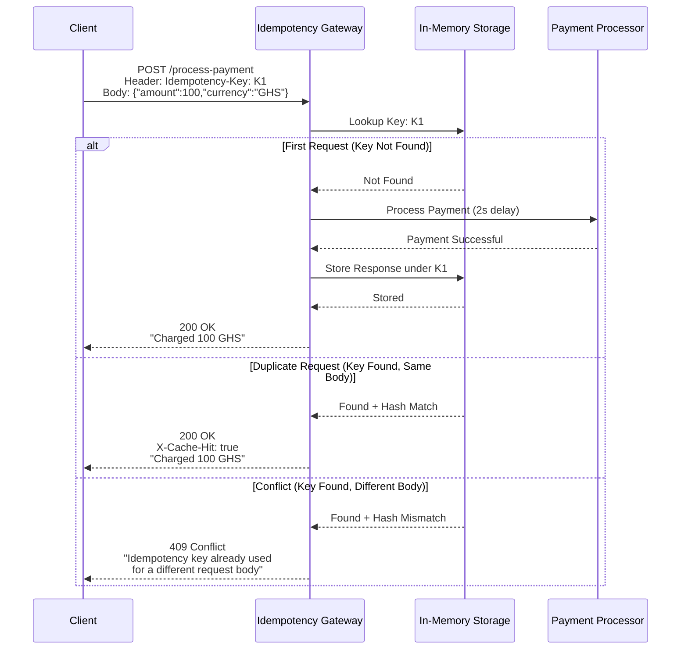

#  Idempotency Gateway | IgirePay Challenge

A pure Java implementation of a payment idempotency layer that ensures every transaction is processed **exactly once**, even when clients retry requests due to network timeouts.

##  Table of Contents

- [Architecture Diagram](#architecture-diagram)
- [Setup Instructions](#setup-instructions)
- [API Documentation](#api-documentation)
- [Design Decisions](#design-decisions)
- [Developer's Choice Feature](#developers-choice-feature)
- [Bonus: Race Condition Handling](#bonus-race-condition-handling)
- [Testing](#testing)
- [Project Structure](#project-structure)

##  Architecture Diagram

---

flowchart TD
    A[Client Request with Idempotency-Key] --> B{Check Storage}
    
    B -->|New Key| C[Acquire Lock for Key]
    B -->|Existing Key| D{Compare Body Hash}
    
    C --> E[Simulate Payment Processing 2 second delay]
    E --> F[Store Response in Cache]
    F --> G[Release Lock]
    G --> H[Return 200 OK]
    
    D -->|Hash Matches| I[Return Cached Response X-Cache-Hit: true]
    D -->|Hash Mismatch| J[Return 409 Conflict Error Message]
    
    I --> K[End]
    J --> K
    H --> K
