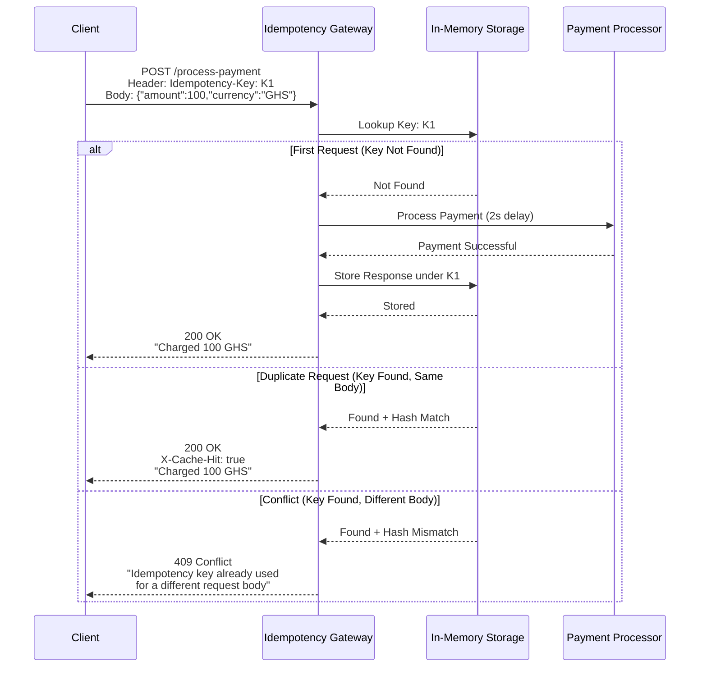

#  Idempotency Gateway | IgirePay Challenge

A pure Java implementation of a payment idempotency layer that ensures every transaction is processed **exactly once**, even when clients retry requests due to network timeouts.


##  Table of Contents

- [Architecture Diagram](#architecture-diagram)
- [Setup Instructions](#setup-instructions)
- [API Documentation](#api-documentation)
- [Design Decisions](#design-decisions)
- [Developer's Choice Feature](#developers-choice-feature)
- [Bonus: Race Condition Handling](#bonus-race-condition-handling)
- [Testing](#testing)
- [Project Structure](#project-structure)


##  Architecture Diagram


---
## Setup Instructions

```bash
git clone https://github.com/Emmalise1/SheCanCode-associate-Assessment-.git
cd SheCanCode-associate-Assessment-
javac -d . src/com/igirepay/*.java
java com.igirepay.Main
```
> Server runs on `http://localhost:8080`


